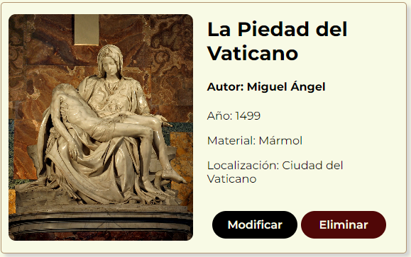
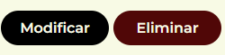
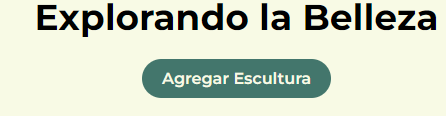

# MappSeum

¡Bienvenido al Museo de Esculturas, MappSeum!

Esta aplicación web fue desarrollada con React y permite gestionar esculturas mediante operaciones CRUD. A continuación, encontrarás detalles adicionales sobre la estructura, funcionalidades y pasos específicos para el CRUD.

**Estructura del Proyecto:**

- Página Principal (Listado de Esculturas):

Muestra un listado de esculturas obtenidas de la API simulada.
Cada tarjeta (card) contiene información detallada sobre una escultura, incluyendo descripción, ubicación, material, etc.
Cada tarjeta incluye botones para eliminar y modificar la escultura correspondiente.

Al hacer clic en "Eliminar" nos aparecerá una confirmacion preguntandonos si queremos eliminar la escultura correspondiente. Se elimina de la API y de la página principal.

- Página de Edición (Modificar Escultura):

Accesible desde la página principal al hacer clic en el botón "Modificar" de una escultura.
Muestra un formulario prellenado con los datos actuales de la escultura seleccionada.
Permite realizar modificaciones y guardar los cambios mediante el método PUT.

- Página de Agregar (Nueva Escultura):

Accesible desde la página principal haciendo clic en el botón "Agregar Escultura".

Proporciona un formulario para agregar una nueva escultura al museo.
Al agregar una nueva escultura, esta se refleja en la página principal. Al rellenar la misma y añadir una nueva, nos redirigirá a la página principal.

La página principal muestra un listado completo de esculturas con detalles específicos.
Explora cada tarjeta para obtener información detallada sobre cada obra en el museo.

**Ejecución del Proyecto:**

**Instalación de Dependencias:**

1. Asegúrate de tener Node.js instalado. 
2. Ejecuta npm install para instalar las dependencias del proyecto.

**Iniciar la API Simulada:**

**Utiliza json-server para simular una API.** 

1. Ejecuta npm install json-server en una terminal.
2. A continuacion ponemos npm init -y
3. npx json-server db.json este nos proporcionara la url del servidor.
4. Ejecuta el servidor de React en otra terminal para mantener los 2 servidores arriba y poder visualizar con exito la web.

Explora y Disfruta:

Explora las esculturas en la página principal.
Utiliza las funciones CRUD: agregar, eliminar, modificar y explorar las obras del museo.

¡Gracias por visitar MappSeum! Esperamos que disfrutes explorando las obras y las funcionalidades de esta aplicación. Si tienes alguna pregunta o problema, no dudes en comunicarte con el equipo de desarrollo. ¡Que disfrutes tu visita! 🎨🏛️
