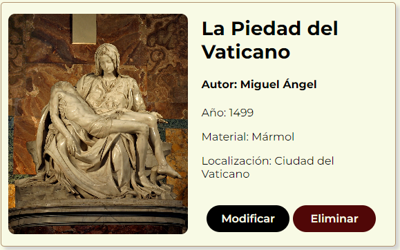
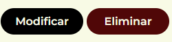
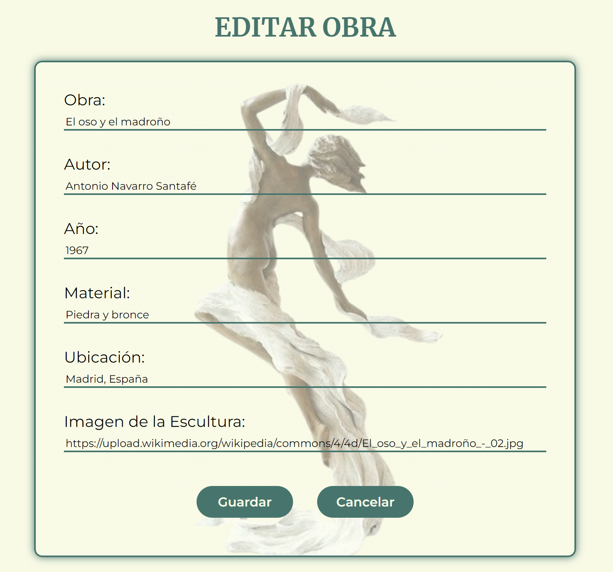
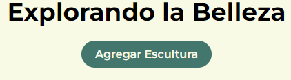
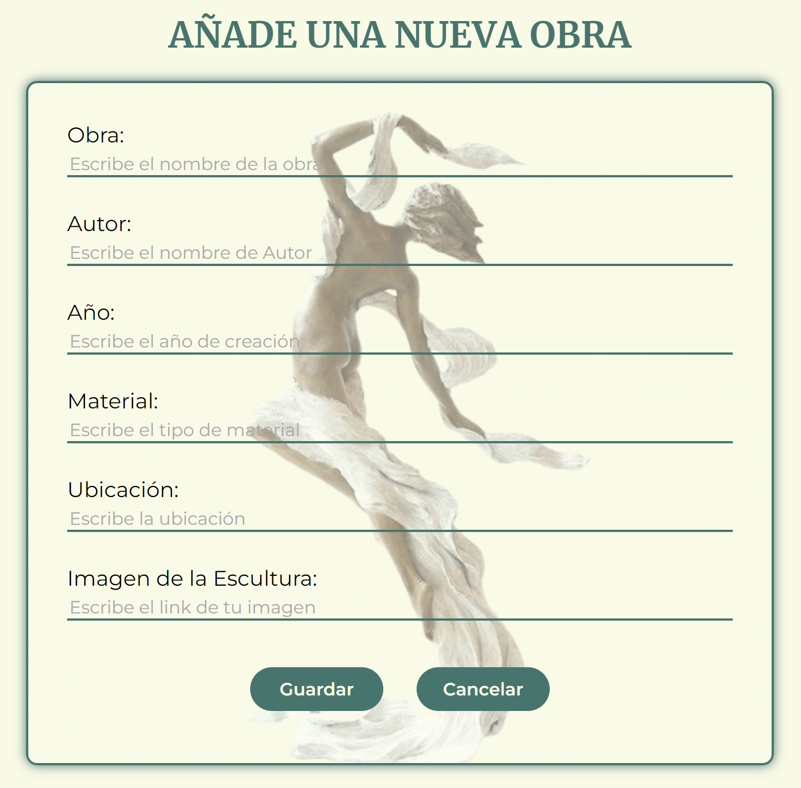

# MappSeum
¡Bienvenido al Museo de Esculturas, MappSeum!

## CONTENIDO

- [DESCRIPCIÓN](#DESCRIPCIÓN)
- [ESTRUCTURA DEL PROYECTO](#ESTRUCTURA-DEL-PROYECTO)
- [LENGUAJES Y HERRAMIENTAS UTILIZADAS](#LENGUAJES-Y-HERRAMIENTAS-UTILIZADAS)
- [INSTALACIÓN](#INSTALACIÓN)
- [COLABORADORAS](#COLABORADORAS)

## DESCRIPCIÓN

Esta aplicación web fue desarrollada con React y permite gestionar esculturas mediante operaciones CRUD. A continuación, encontrarás detalles adicionales sobre la estructura, funcionalidades y pasos específicos para el CRUD.

## ESTRUCTURA DEL PROYECTO

### Página Principal (Listado de Esculturas):

Muestra un listado de esculturas obtenidas de la API simulada.
Cada tarjeta (card) contiene información detallada sobre una escultura, incluyendo descripción, ubicación, material, etc.
Cada tarjeta incluye botones para eliminar y modificar la escultura correspondiente.



Al hacer clic en "Eliminar" nos aparecerá una confirmación preguntándonos si queremos eliminar la escultura correspondiente. Se elimina de la API y de la página principal.

### Página de Edición (Modificar Escultura):



Accesible desde la página principal al hacer clic en el botón "Modificar" de una escultura.

Muestra un formulario prellenado con los datos actuales de la escultura seleccionada.



Permite realizar modificaciones y guardar los cambios mediante el método PUT..

### Página de Agregar (Nueva Escultura):



Accesible desde la página principal haciendo clic en el botón "Agregar Escultura".

Proporciona un formulario para agregar una nueva escultura al museo.



Al agregar una nueva escultura, esta se refleja en la página principal. Al rellenar el formulario y añadir una nueva escultura, nos redirigirá a la página principal.

La página principal muestra un listado completo de esculturas con detalles específicos. Explora cada tarjeta para obtener información detallada sobre cada obra en el museo.

## LENGUAJES Y HERRAMIENTAS UTILIZADAS
<div>
  &nbsp;
  &nbsp;
  &nbsp;   
  &nbsp;
  &nbsp;   
      
  &nbsp;     
  &nbsp;    
  &nbsp;  
  &nbsp; 
  &nbsp; 
  &nbsp; 
  &nbsp;
</div>

## INSTALACIÓN

### Clonar el repositorio:

```bash
$ git clone https://github.com/BeatrizCPerez/MappSeum
```

```bash
$ cd MappSeum
```

### Instalar las dependencias:

1. Asegúrate de tener Node.js instalado.
2. Ejecuta el siguiente comando para instalar las dependencias del proyecto:

```bash
$ npm install
```

### Iniciar la API Simulada:

Utiliza json-server para simular una API.
```bash
$ npm run api
```   

### Iniciar el Servidor de Desarrollo:
```bash
$ npm run dev
```

## COLABORADORAS
- Scrum Master: [Leite](https://github.com/leiteway)
- Product Owner: [Beatriz](https://github.com/BeatrizCPerez)
- Web developer: [Kris](https://github.com/krisneiras)
- Web developer: [Maria](https://github.com/mariandrean)
